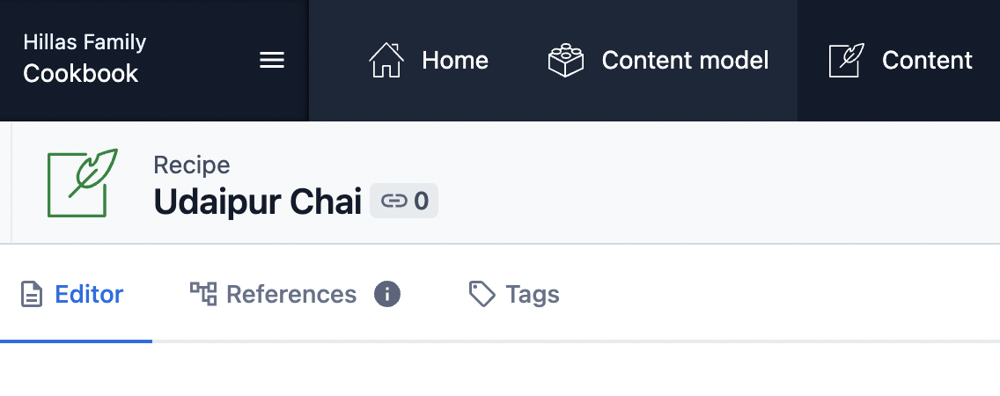
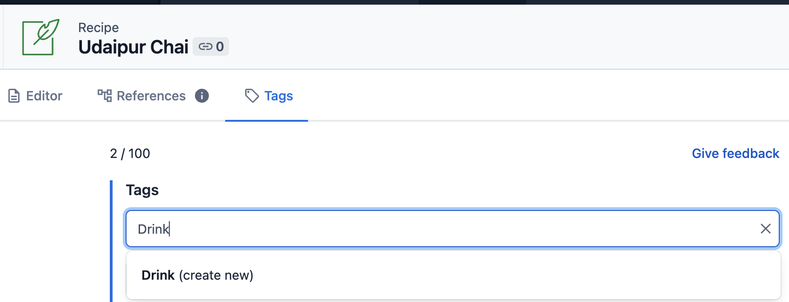

# Adding a New Recipe

The recipes are added and stored in a Contentful organization. Contentful is a Content Management System (CMS) that supports all different kinds of content from ecommerce sites to personal blogs. We're using it to store all of our recipes + comments. Ask your cookbook admin to [add you to the Contentful organization](./adding_new_users.md).

## Easy Mode — Just Pictures!*

A lot of the recipes we enjoy are already written down somewhere maybe on a recipe card or in a physical cookbook. If you'd like to quickly add a recipe to your cookbook, you just need:

- A recipe title (E.g. "Vintage Chocolate Custard")
- The author
- A serving size (E.g. "1 pint")
- A short description (E.g. "My favorite chocolate custard")
- A few images, snapped from your phone!

### 1 — [Log into Contentful and navigate to the Content Tab](https://app.contentful.com/spaces/kk2euocn6y07/entries)
### 2 — Click on the "Add Entry" button near the top right to start a new recipe entry
### 3 — Fill out the title, author, serving size, short description
### 4 — Add your images*

- When you get to the "Images" section of the new entry page, you'll see a "Add Media" button.
- Click on the button and select "Add new media"
- This will take you to a new page to add an image to Contentful.
    - Title the image — Not very important what the title is. The title will only be displayed in Contentful and not on the cookbook
    - Add an image — Click on "Open File Selector" and choose the photo you would like to add
    - Once the image processing has completed, publish the image to Contentful with the big green "Publish" button
    - Exit back to the recipe by clicking on the arrow in the top left of the screen
- You will now see the image as an entry in the list of images. Repeat these steps for as many images as you would like to add.

### 5 — Publish your recipe!

Click on the big green "Publish Changes" button on the right side of the page

*Easiest when adding a recipe from your phone because you can add images straight from your phone!

## Complete Mode — Full descriptions, ingredients + steps

In addition to filling out simple recipes with just a few pieces of info + images, you can also take full controll and list out the full recipe with ingredients, steps and the story. You can also tag the recipe to allow you to quickly search for similar recipes (e.g. "Breakfast", "Dessert", "Under 60 minutes").

### Recipe Writing

If you want to write out the whole recipe with ingredients and steps, fill out the "body" field in Contentful. This type of field in Contentful allows for whats called [markdown](https://www.contentful.com/blog/2020/05/25/beginners-guide-to-contentful-text-types-markdown-richtext/).

Typically, our recipe bodies are split into 3 sections.

- Story — Write out how you came to find this recipe. Typically...I skip this section, but many recipe sites facilitate this section.
- Ingredients — Simple list of ingredients with proportions
- Process — Write out how you take the recipe from ingredients to masterpiece

Pretty...simple, huh?

You can write out these sections however you like. The markdown will get converted to get shown on your online cookbook appropriately with the exception of images. I would avoid putting images in the recipe body for now. Use the images section for images.

### Tags

You can tag recipes to group together similar favorites. Examples include "Dessert" or "Breakfast." You can also do...whatever you like! Time based tagging is an option: "Under 30 minutes", "Under 60 minutes."

#### Go to the tabs section of your recipe

When viewing a recipe in Contentful, click on the "Tags" tab of the recipe entry editor.

#### Start typing in the tags search to find or create a new tag

#### Create the tag

Be sure to check the "Public" tag so that the site will be able to query this tag and show it on your cookbook.

#### Publish the changes to the recipe

Click on the big green button to publish these tag changes for your recipe. This will kick off the process to rebuild the cookbook. In a few minutes, you'll see the tag on your online cookbook.
